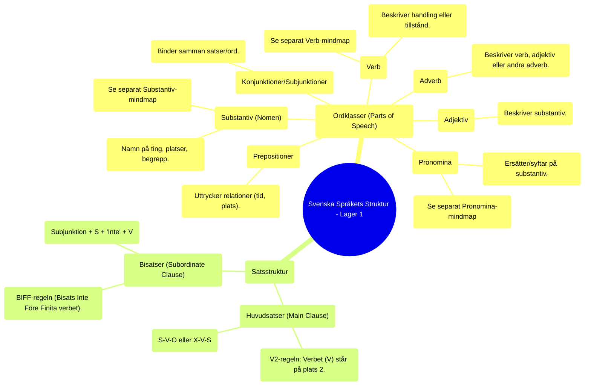

# Svenska för Ingenörer

## innehållsförteckning
1. Ordklasser och satsstruktur
2. 

## Lager 1 : Ordklasser

```mermaid
mindmap
    root((Svenska Språkets Struktur - Lager 1))
        
        ORDKLASSER("Ordklasser (Parts of Speech)")
            SUBSTANTIV("Substantiv (Nomen)")
                Funktion("Namn på ting, platser, begrepp.")
                NästaSteg("Se separat Substantiv-mindmap")
            VERB("Verb")
                Funktion("Beskriver handling eller tillstånd.")
                NästaSteg("Se separat Verb-mindmap")
            ADJEKTIV("Adjektiv")
                Funktion("Beskriver substantiv.")
            PRONOMINA("Pronomina")
                Funktion("Ersätter/syftar på substantiv.")
                NästaSteg("Se separat Pronomina-mindmap")
            ADVERB("Adverb")
                Funktion("Beskriver verb, adjektiv eller andra adverb.")
            PREPOSITIONER("Prepositioner")
                Funktion("Uttrycker relationer (tid, plats).")
            KONJUNKTIONER("Konjunktioner/Subjunktioner")
                Funktion("Binder samman satser/ord.")

        SATSSCHEMA("Satsstruktur")
            HUVUDSATSER("Huvudsatser (Main Clause)")
                Regel("V2-regeln: Verbet (V) står på plats 2.")
                Mönster("S-V-O eller X-V-S")
            BI-SATSER("Bisatser (Subordinate Clause)")
                Regel("BIFF-regeln (Bisats Inte Före Finita verbet).")
                Mönster("Subjunktion + S + 'Inte' + V")
```
