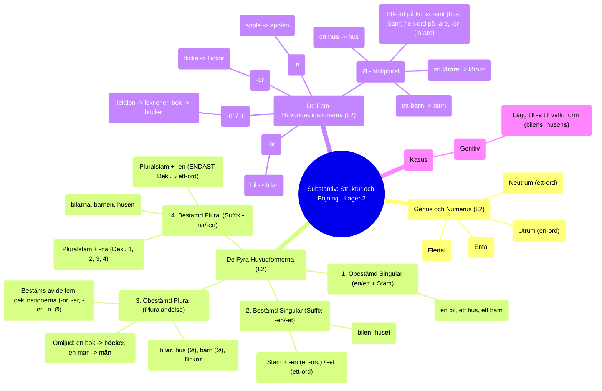

```mermaid
mindmap
    root((Substantiv: Struktur och Böjning - Lager 2))

        GENDER("Genus och Numerus (L2)")
            EN("Utrum (en-ord)")
            ETT("Neutrum (ett-ord)")
            SINGULAR("Ental")
            PLURAL("Flertal")

        HUVUDFORMER("De Fyra Huvudformerna (L2)")
            OBESTÄMD_SINGULAR("1. Obestämd Singular (en/ett + Stam)")
                EX_OBS("en bil, ett hus, ett barn")
            BESTÄMD_SINGULAR("2. Bestämd Singular (Suffix -en/-et)")
                REGEL_BS("Stam + -en (en-ord) / -et (ett-ord)")
                EX_BS("bil**en**, hus**et**")
            OBESTÄMD_PLURAL("3. Obestämd Plural (Pluraländelse)")
                FEM_DEKLINATIONER("Bestäms av de fem deklinationerna (-or, -ar, -er, -n, Ø)")
                EX_OP("bil**ar**, hus (Ø), barn (Ø), flick**or**")
                UNDANTAG_OP("Omljud: en bok -> b**öck**er, en man -> m**än**")
            BESTÄMD_PLURAL("4. Bestämd Plural (Suffix -na/-en)")
                REGEL_BP_NA("Pluralstam + -na (Dekl. 1, 2, 3, 4)")
                REGEL_BP_EN("Pluralstam + -en (ENDAST Dekl. 5 ett-ord)")
                EX_BP("bil**arna**, barn**en**, hus**en**")
                
        DEKLINATIONER("De Fem Huvuddeklinationerna (L2)")
            DEK_1("-or")
                EX("flicka -> flickor")
            DEK_2("-ar")
                EX("bil -> bilar")
            DEK_3("-er / -r")
                EX("lektion -> lektioner, bok -> böcker")
            DEK_4("-n")
                EX("äpple -> äpplen")
            DEK_5("Ø - Nollplural")
                REGEL_5("Ett-ord på konsonant (hus, barn) / en-ord på -are, -er (lärare)")
                EX_5A("ett **hus** -> hus")
                EX_5B("ett **barn** -> barn")
                EX_5C("en **lärare** -> lärare")

        KASUS("Kasus")
            GENITIV("Genitiv")
                REGEL("Lägg till **-s** till valfri form (bilen**s**, husen**s**)")
```
