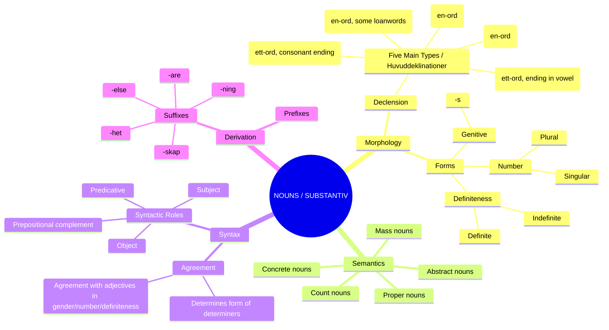

```mermaid
mindmap
  root((NOUNS / SUBSTANTIV))
    Morphology
      Declension
        Five Main Types / Huvuddeklinationer
          Group 1: -or (en-ord)
          Group 2: -ar (en-ord)
          Group 3: -er (en-ord, some loanwords)
          Group 4: -n  (ett-ord, ending in vowel)
          Group 5: Ø   (ett-ord, consonant ending)
      Forms
        Number
          Singular
          Plural
        Definiteness
          Indefinite
          Definite
        Genitive
          -s
    Semantics
      Concrete nouns
      Abstract nouns
      Count nouns
      Mass nouns
      Proper nouns
    Syntax
      Syntactic Roles
        Subject
        Object
        Predicative
        Prepositional complement
      Agreement
        Determines form of determiners
        Agreement with adjectives in gender/number/definiteness
    Derivation
      Prefixes
      Suffixes
        -het
        -skap
        -ning
        -are
        -else

```
