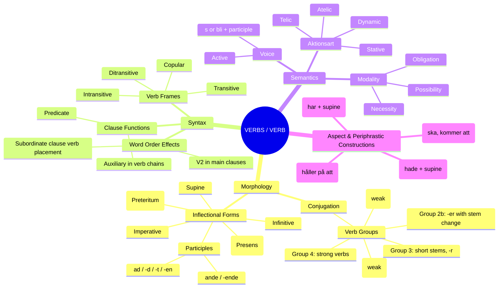

```mermaid
mindmap
  root((VERBS / VERB))
    Morphology
      Conjugation
        Verb Groups
          Group 1: -ar (weak)
          Group 2a: -er (weak)
          Group 2b: -er with stem change
          Group 3: short stems, -r
          Group 4: strong verbs
      Inflectional Forms
        Infinitive
        Present (Presens)
        Preterite (Preteritum)
        Supine
        Imperative
        Participles
          Present participle (-ande / -ende)
          Past participle (-ad / -d / -t / -en)
    Syntax
      Clause Functions
        Predicate
        Auxiliary in verb chains
      Verb Frames
        Intransitive
        Transitive
        Ditransitive
        Copular
      Word Order Effects
        V2 in main clauses
        Subordinate clause verb placement
    Semantics
      Aktionsart
        Stative
        Dynamic
        Telic
        Atelic
      Voice
        Active
        Passive (-s or bli + participle)
      Modality
        Possibility
        Necessity
        Obligation
    Aspect & Periphrastic Constructions
      Ongoing (håller på att)
      Future (ska, kommer att)
      Perfect (har + supine)
      Pluperfect (hade + supine)

```
