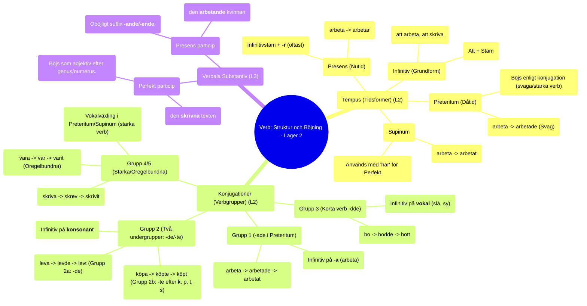

```mermaid
mindmap
    root((Verb: Struktur och Böjning - Lager 2))

        TEMPUS("Tempus (Tidsformer) (L2)")
            PRESENS("Presens (Nutid)")
                Regel_Presens("Infinitivstam + **-r** (oftast)")
                EX_Presens("arbeta -> arbetar")
            PRETERITUM("Preteritum (Dåtid)")
                Konjugationer("Böjs enligt konjugation (svaga/starka verb)")
                EX_Pret("arbeta -> arbetade (Svag)")
            SUPINUM("Supinum")
                Användning("Används med 'har' för Perfekt")
                EX_Sup("arbeta -> arbetat")
            INFINITIV("Infinitiv (Grundform)")
                Markör("Att + Stam")
                EX_Inf("att arbeta, att skriva")

        KONJUGATIONER("Konjugationer (Verbgrupper) (L2)")
            GRUPP_1("Grupp 1 (-ade i Preteritum)")
                Regel_1("Infinitiv på **-a** (arbeta)")
                EX_1("arbeta -> arbetade -> arbetat")
            GRUPP_2("Grupp 2 (Två undergrupper: -de/-te)")
                Regel_2("Infinitiv på **konsonant**")
                EX_2A("leva -> levde -> levt (Grupp 2a: -de)")
                EX_2B("köpa -> köpte -> köpt (Grupp 2b: -te efter k, p, t, s)")
            GRUPP_3("Grupp 3 (Korta verb -dde)")
                Regel_3("Infinitiv på **vokal** (slå, sy)")
                EX_3("bo -> bodde -> bott")
            GRUPP_4_5("Grupp 4/5 (Starka/Oregelbundna)")
                Regel_45("Vokalväxling i Preteritum/Supinum (starka verb)")
                EX_4("skriva -> skr**e**v -> skr**i**vit")
                EX_5("vara -> var -> varit (Oregelbundna)")
        
        VERBALA_SUBSTANTIV("Verbala Substantiv (L3)")
            PERFEKTPARTICIP("Perfekt particip")
                Regel("Böjs som adjektiv efter genus/numerus.")
                EX("den **skrivna** texten")
            PRESENTPARTICIP("Presens particip")
                Regel("Oböjligt suffix **-ande/-ende**.")
                EX("den **arbetande** kvinnan")
```
