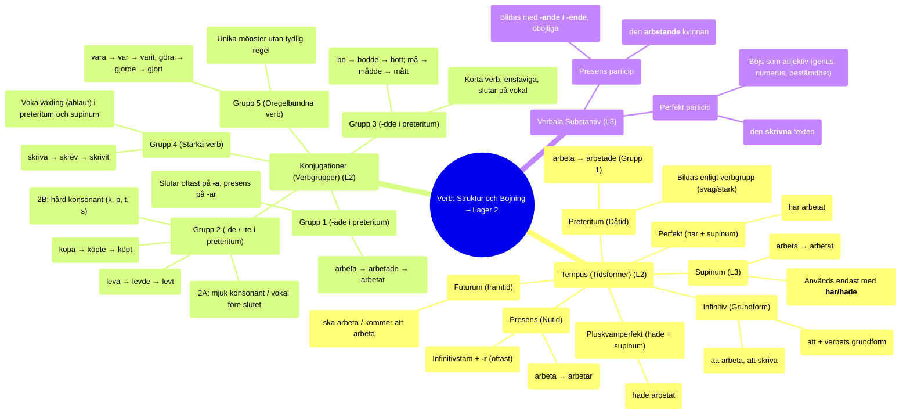

```mermaid
mindmap
    root((Verb: Struktur och Böjning – Lager 2))

        TEMPUS("Tempus (Tidsformer) (L2)")
            PRESENS("Presens (Nutid)")
                Regel_Presens("Infinitivstam + **-r** (oftast)")
                EX_Presens("arbeta → arbetar")
            PRETERITUM("Preteritum (Dåtid)")
                Konjugationer("Bildas enligt verbgrupp (svag/stark)")
                EX_Pret("arbeta → arbetade (Grupp 1)")
            SUPINUM("Supinum (L3)")
                Funktion("Används endast med **har/hade**")
                EX_Sup("arbeta → arbetat")
            PERFEKT("Perfekt (har + supinum)")
                EX_Perf("har arbetat")
            PLUSKVAMPERFEKT("Pluskvamperfekt (hade + supinum)")
                EX_Plus("hade arbetat")
            FUTURUM("Futurum (framtid)")
                EX_Fut("ska arbeta / kommer att arbeta")
            INFINITIV("Infinitiv (Grundform)")
                Markör("att + verbets grundform")
                EX_Inf("att arbeta, att skriva")

        KONJUGATIONER("Konjugationer (Verbgrupper) (L2)")
            GRUPP_1("Grupp 1 (-ade i preteritum)")
                Regel_1("Slutar oftast på **-a**, presens på -ar")
                EX_1("arbeta → arbetade → arbetat")
            GRUPP_2("Grupp 2 (-de / -te i preteritum)")
                REGEL_2A("2A: mjuk konsonant / vokal före slutet")
                EX_2A("leva → levde → levt")
                REGEL_2B("2B: hård konsonant (k, p, t, s)")
                EX_2B("köpa → köpte → köpt")
            GRUPP_3("Grupp 3 (-dde i preteritum)")
                Regel_3("Korta verb, enstaviga, slutar på vokal")
                EX_3("bo → bodde → bott; må → mådde → mått")
            GRUPP_4("Grupp 4 (Starka verb)")
                Regel_4("Vokalväxling (ablaut) i preteritum och supinum")
                EX_4("skriva → skrev → skrivit")
            GRUPP_5("Grupp 5 (Oregelbundna verb)")
                Regel_5("Unika mönster utan tydlig regel")
                EX_5("vara → var → varit; göra → gjorde → gjort")

        VERBALA_SUBSTANTIV("Verbala Substantiv (L3)")
            PERFEKTPARTICIP("Perfekt particip")
                Regel_PP("Böjs som adjektiv (genus, numerus, bestämdhet)")
                EX_PP("den **skrivna** texten")
            PRESENSPARTICIP("Presens particip")
                Regel_PresP("Bildas med **-ande / -ende**, oböjliga")
                EX("den **arbetande** kvinnan")
```
